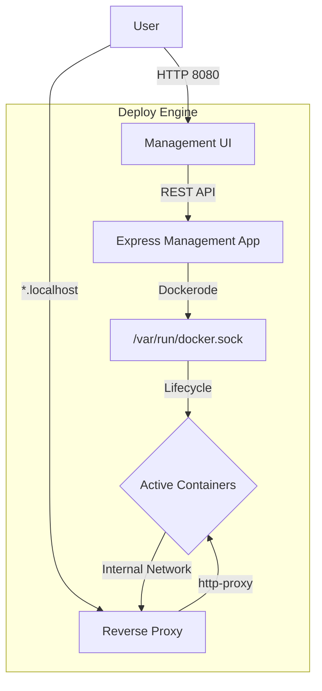

# Deploy Engine 🚀

A sophisticated, minimalistic container orchestration and management platform built with Node.js and Docker. This engine provides a "classy" web interface to deploy, monitor, and manage ephemeral environments with automatic reverse proxy routing.

## 🏗 Architecture

The system consists of two primary layers: the **Management API** and the **Reverse Proxy**.



### Core Components
- **Management API (Port 8080)**: Handles container creation, image pulling, lifecycle management (Stop/Delete), and monitoring.
- **Reverse Proxy (Port 80)**: Automatically routes traffic from subdomains (e.g., `container-name.localhost`) to the corresponding internal container on port 80.
- **Docker Engine Integration**: Direct communication via the Docker socket for real-time orchestration.

## ✨ Features
- **Luxury Minimalist UI**: A refined dark-mode dashboard for a professional deployment experience.
- **Instant Deployment**: Automatic image pulling and container instantiation.
- **Dynamic Routing**: Zero-config subdomains for every deployed service.
- **Lifecycle Control**: Real-time status monitoring with Stop and Delete capabilities.
- **Auto-Cleanup**: Optional ephemeral mode (Auto-Remove) for resource efficiency.

## 🚀 Getting Started

### Prerequisites
- Docker & Docker Compose
- Node.js (v24+ recommended)

### Installation & Setup

1. **Clone the repository**
   ```bash
   git clone <repository-url>
   cd deploy-engine
   ```

2. **Run with Docker Compose**
   The easiest way to start the engine is using the provided compose file:
   ```bash
   docker-compose up --build
   ```

3. **Access the Engine**
   - **Management Dashboard**: [http://localhost:8080](http://localhost:8080)
   - **Deploys**: Accessible via `http://<container-name>.localhost`

## 🛠 Tech Stack
- **Backend**: Node.js, Express.js
- **Orchestration**: Dockerode (Docker Remote API)
- **Proxy**: http-proxy
- **Frontend**: Vanilla JS, CSS3 (Luxury Minimalist Aesthetic)
- **Fonts**: Syne, Manrope

## 📖 API Reference

### Containers
| Method | Endpoint | Description |
| :--- | :--- | :--- |
| `POST` | `/container` | Deploy a new container from image/tag |
| `GET` | `/containers` | List all active environments |
| `POST` | `/container/:id/stop` | Stop a running environment |
| `DELETE` | `/container/:id` | Force remove an environment |

## ⚖️ License
This project is licensed under the ISC License.
